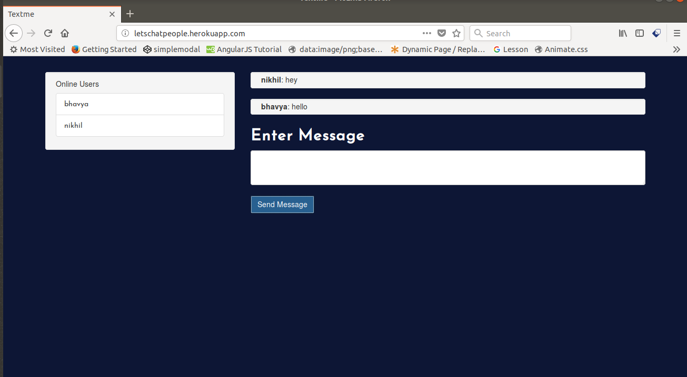

# chat-app
Chat-App built using Nodejs and Express

# Screenshot

# Description
 ## Initial requirements
   *Installing NodeJs*

   curl -sL https://deb.nodesource.com/setup_8.x | sudo -E bash -
   
   sudo apt-get install -y nodejs
 
1. Create an empty directory(any name).

2. Using terminal, type : npm init 

3. Create dependencies

4. Using terminal, type : npm install (To create all node modules including express)

5. Paste the Github files in the directory

6. Using the terminal run: node server

7. Open the web browser and type : http://localhost:3000/
